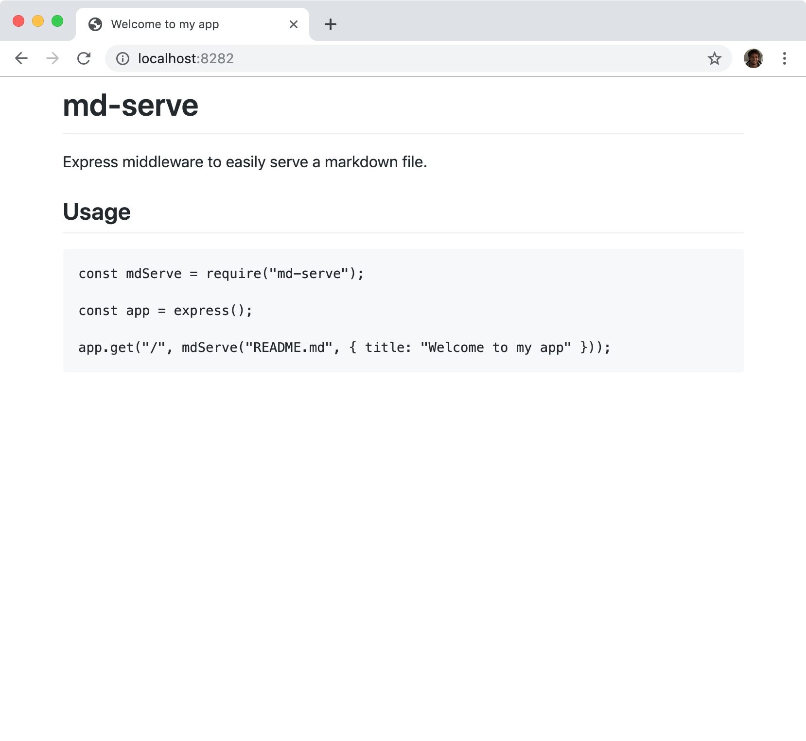

# markdown-express-middleware

Express middleware to easily serve a markdown file with the GitHub-style CSS built in.

## Usage

```js
const express = require("express");
const mdem = require("markdown-express-middleware");

const app = express();

app.get("/", mdem("README.md", { title: "Welcome to my app" }));

app.listen(PORT);
```


