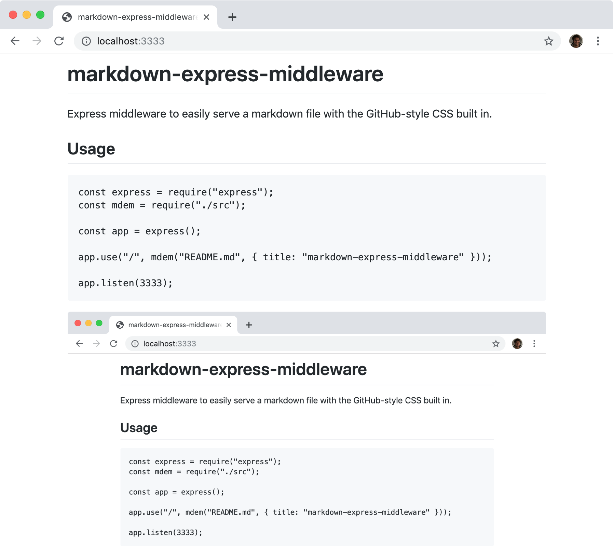

# md-serve

Express middleware to easily serve a markdown file with the GitHub-style CSS built in.

## Usage

```js
const express = require("express");
const mdServe = require("md-serve");

const app = express();

app.get("/", mdServe("README.md", { title: "Welcome to my app" }));

app.listen(PORT);
```


